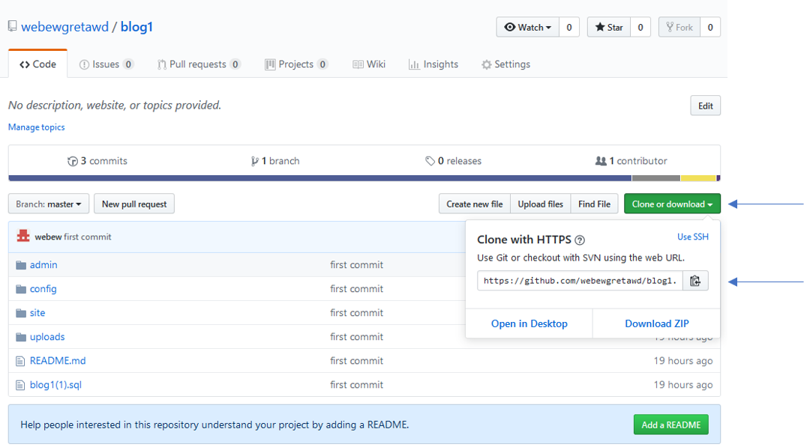

# Rappels concernant le clonage sur Github
1. Rendez-vous à l'url [https://github.com/webewgretawd/blog1](https://github.com/webewgretawd/blog1) (normalement vous y êtes déjà).
2. Cliquez sur le bouton vert intitulé *Clone or download*.

3. Copiez l'url.
4. Ouvrez une invite de commande (**cmd** dans la recherche Windows ou **terminal** pour Linux et Mac).
5. Rendez-vous dans votre répertoire web.
6. Saisissez la commande **git clone https://github.com/webewgretawd/blog1.git**

# Informations et consignes
1. Vous placerez votre code dans le répertoire *site*.
2. La structure de ce répertoire est déjà définie.
3. Les pages sont déjà présentes ainsi que quelques fonctionnalités.
4. Créez une base de données dans [http://localhost/phpmyadmin/](http://localhost/phpmyadmin/) intitulée *base1*.
5. Importez-y le fichier *blog1(1).sql*.
6. Ouvrez le répertoire du projet dans votre éditeur de code, puis configurez vos paramètres de base de données dans le fichier *config/configBdd.php*.
7. Pour alimenter la base de données, connectez-vous à l'url [http://localhost/admin](http://localhost/blog1/admin) avec l'email **toto@toto.fr** et le mot de passe **toto**.
8. Commencez par créer des catégories, puis des articles avec ou sans image (format jpg ou png taille inférieure à 500ko).
9. Quelques images sont disponibles dans *site/img*, mais vous pouvez utiliser celles que vous voulez.
10. Une fois que vous avez quelques articles, testez leur affichage à [http://localhost/blog1/site/articles.php](http://localhost/blog1/site/articles.php)
11. Si vous remarquez un problème ou un bug, contactez-moi.

## Fonctionnalités à implémenter
1. La zone de recherche est déjà codée.
2. La page d'affichage d'un article est déjà codée.
3. Vous devez ajouter à la page *articles.php* une liste déroulante des catégories pour pouvoir filtrer les articles par catégorie.
4. Pour cela, créez un formulaire comprenant une liste déroulante (balise select) ainsi qu'un bouton de validation.
5. Lorsqu'on valide le formulaire, le script appelé (attribut action de la balise form) doit retrouver dans la base de données les articles appartenant à la catégorie sélectionnée.
6. Inspirez-vous du formulaire de recherche existant (le formulaire devra être chargé avec `include` ou `require`).
7. Aucun Css n'est demandé.

Bon courage !

Vous avez le droit de vous entraider ! ;-)
